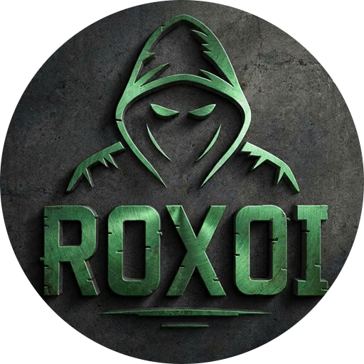
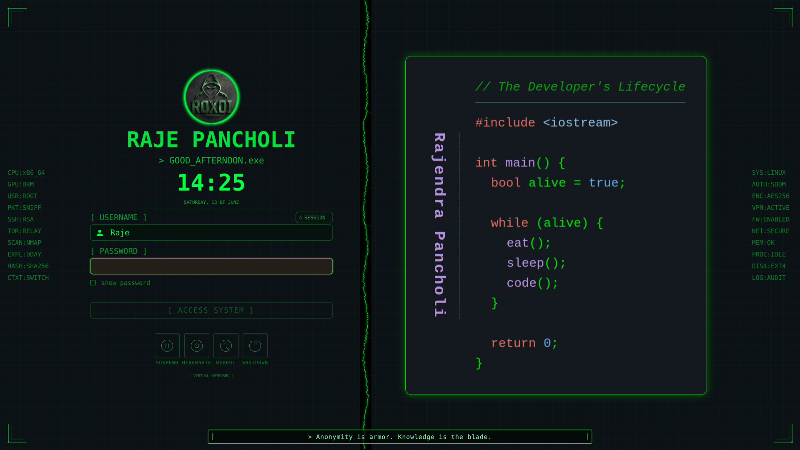
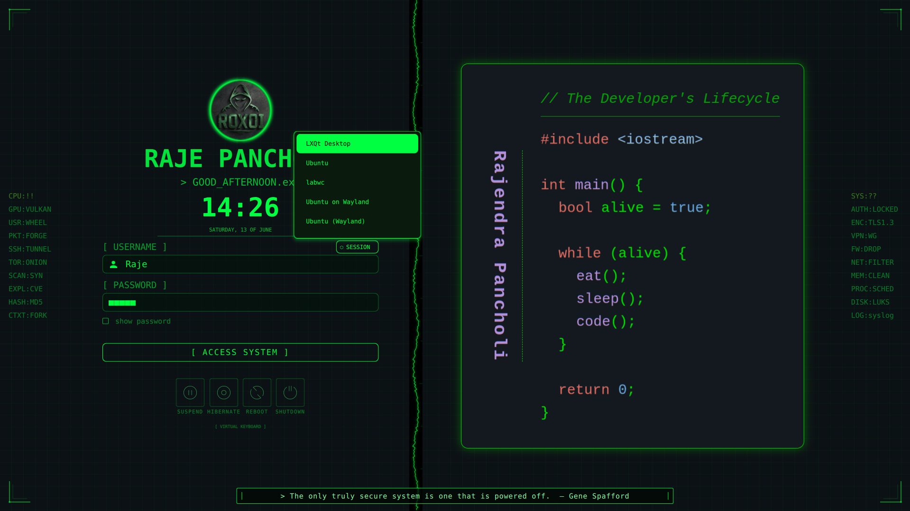
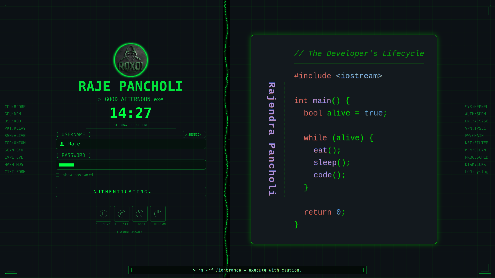

<h1 align="center">
  
  <br>
  <p>ROXOI SDDM Theme</p>
</h1>

<p align="center">
  <a href="#"></a>
  <a href="#"></a>
  <a href="#"></a>
  <a href="#"></a>
  <a href="#"></a>
  <a href="#"></a>
  <a href="#"></a>
</p>

<p align="center">
  <a href="#-preview">Preview</a> •
  <a href="#-features">Features</a> •
  <a href="#-file-structure">Structure</a> •
  <a href="#-components">Components</a> •
  <a href="#-installation">Installation</a> •
  <a href="#-configuration">Configuration</a> •
  <a href="#-dependencies">Dependencies</a> •
  <a href="#-legal--ethical-use">Legal</a>
</p>

---

## Preview

> A terminal-aesthetic SDDM login theme with glowing green-on-black HUD elements, animated oscilloscope border, rotating hacker quotes, and a full system-status sidebar — built entirely in QML.



---



---



---

## Features

- **Hacker / terminal aesthetic** — monospace fonts, `#00ff41` green-on-black color scheme throughout, matching classic terminal output
- **Animated oscilloscope border** — a live Canvas-rendered signal waveform divides the left panel from the background
- **Dual HUD data strips** — left and right sidebars display cycling system labels (`CPU`, `GPU`, `AUTH`, `ENC`, `TOR`, `SCAN`, `EXPL`, etc.) with per-row glitch animations and staggered flicker
- **Corner HUD brackets** — four-corner scope brackets rendered via Canvas give the screen a tactical overlay feel
- **Glowing hex-ring logo** — Canvas-drawn animated logo with radial bloom, pulsing glow, and inner hexagon; animates on opacity with an `InOutSine` loop
- **Rotating hacker quotes** — 46-quote pool cycles at the bottom bar with fade-in/fade-out transitions every 8 seconds
- **Time-aware greeting** — displays `GOOD_MORNING.exe`, `GOOD_AFTERNOON.exe`, `GOOD_EVENING.exe`, or `GOOD_NIGHT.exe` based on system hour, with double-blink cursor effect
- **Session picker** — compact session selector button inline with the username label; only visible when more than one session exists
- **Show-password toggle** — animated checkbox with green fill transition
- **Authentication state animation** — login button switches to a scrolling block-character progress animation (`⏹⏹⏹⏹⏹`) during PAM authentication
- **Caps-lock and failed-login warnings** — inline error label with separate colors (`#ff4444` for access denied, `#ffaa00` for caps lock)
- **Virtual keyboard support** — slide-up `InputPanel` with animated Y-transition; toggled by a `[ VIRTUAL KEYBOARD ]` button
- **System power buttons** — Suspend, Hibernate, Reboot, Shutdown rendered as SVG icon + label pairs with hover glow
- **RTL layout support** — `LayoutMirroring` propagation via `config.ForceRightToLeft`
- **Fully config-driven** — font, font size, colors, background, padding, locale, date/time format, and behavioral flags all read from the SDDM theme config

---

## File Structure

```
roxoi-sddm/
├── Main.qml                    Root pane — layout, background, HUD strips, quote bar, virtual keyboard
├── Components/
│   ├── Clock.qml               Logo canvas, greeting, time, date, separator
│   ├── Input.qml               Username field, password field, show-password, login button, error label
│   ├── LoginForm.qml           Column assembling Clock + Input + SystemButtons + VKB toggle
│   ├── SessionButton.qml       Session picker button and popup list
│   ├── SystemButtons.qml       Suspend / Hibernate / Reboot / Shutdown icon buttons
│   ├── UserList.qml            Horizontal user avatar list (optional)
│   └── VirtualKeyboard.qml     Qt Virtual Keyboard InputPanel with slide-up animation
├── Assets/
│   ├── User.svgz               User icon for the username combo indicator
│   ├── Suspend.svgz            Power button icons
│   ├── Hibernate.svgz
│   ├── Reboot.svgz
│   └── Shutdown.svgz
├── Backgrounds/
│   └── Mainbg.png              Background wallpaper (right-aligned, aspect-crop)
└── theme.conf                  SDDM theme configuration file
```

---

## Components

### `Main.qml`
The root `Pane`. Handles global palette, font, layout mirroring, and assembles all visual layers in z-order:

| z | Layer |
|---|-------|
| 0 | Base dark fill (`#050f07`) |
| 1 | Background image (right-aligned, 0.85 opacity) |
| 7 | Oscilloscope signal canvas (animated waveform border) |
| 8 | Right HUD data strip (SYS / AUTH / ENC / VPN / FW / NET / MEM / PROC / DISK / LOG) |
| 8 | Left HUD data strip (CPU / GPU / USR / PKT / SSH / TOR / SCAN / EXPL / HASH / CTXT) |
| 9 | Corner bracket canvas |
| 13 | `LoginForm` + `VirtualKeyboard` loader |
| 14 | Quote bar |

Contains a 46-entry `hackerQuotes` array that cycles via `ScriptAction` inside the quote label's `SequentialAnimation`.

### `Clock.qml`
Self-contained column: glowing hex-ring `Canvas` logo → name label → time-aware greeting → `HH:mm` time label → locale-formatted date label → animated separator. A `Timer` at 1000ms interval drives live clock updates.

### `Input.qml`
All authentication UI:
- Hidden `ComboBox` bound to `sessionModel` for session tracking
- Username `ComboBox` (user icon indicator + green popup) overlaid by a transparent `TextField` for free-text entry
- Password `TextField` with `echoMode` toggled by `revealCheck`; `passwordCharacter: "■"`
- `CheckBox` for show-password with animated fill indicator
- Error `Label` driven by `inputContainer.failed` and `keyboard.capsLock` states
- Login `Button` with idle vs. authenticating label swap and `authDotTimer`-driven block-character progress bar

### `LoginForm.qml`
Thin composition layer. Assembles `Clock`, `Input`, `SystemButtons`, and the virtual keyboard toggle `Button` into a single `Column` centered in the panel.

### `SessionButton.qml`
Inline session picker: a `Button` displaying the current session name + hex icon (`⬡`), opening a `Popup` `ListView` above the username row. Emits `sessionChanged(int)` on selection.

### `SystemButtons.qml`
A `RowLayout` `Repeater` over `[suspend, hibernate, reboot, shutdown]` model entries. Each item is an `Item` with background `Rectangle`, SVG icon via `ColorOverlay`, label, and plain `MouseArea` that calls the respective `sddm.*()` method. Capability flags (`sddm.canSuspend`, etc.) control opacity; hover triggers background fill and glow.

### `UserList.qml`
Horizontal `ListView` of user avatars: circular `Rectangle` border + `Image` with `ColorOverlay` green tint + username `Label`. Selection driven by `currentIndex`. Not wired into the main layout by default — available for themes that want a graphical user picker.

### `VirtualKeyboard.qml`
Wraps Qt's `InputPanel` with a `State`/`Transition` pair that slides it up from `parent.height` to `parent.height - inputPanel.height` over 250ms with `OutCubic` easing.

---

## Installation

### Requirements

- **SDDM** `>= 0.18`
- **Qt** `>= 5.11` with `QtQuick`, `QtQuick.Controls 2.x`, `QtGraphicalEffects`
- Optional: `Qt.labs.virtualKeyboard` for virtual keyboard support

### Steps

```bash
# 1. Clone the repository
git clone https://github.com/rajendrapancholi/roxoi-sddm

# 2. Copy theme to SDDM themes directory
sudo cp -r roxoi-sddm /usr/share/sddm/themes/

# 3. Set the theme in SDDM config
sudo nano /etc/sddm.conf
```

Add or update the `[Theme]` section:

```ini
[Theme]
Current=roxoi-sddm
```

```bash
# 4. Restart SDDM to apply
sudo systemctl restart sddm
```

### Preview without rebooting

```bash
sddm-greeter --test-mode --theme /usr/share/sddm/themes/roxoi-sddm
```

---

## Configuration

Edit `theme.conf` in the theme directory. All keys below are optional — the theme falls back to sensible defaults when they are absent.

```ini
[General]
# Fonts
Font=Monospace
FontSize=                   # Leave blank to auto-scale: screen_height / 80

# Colors
MainColor=#00ff41
AccentColor=#00ff41
BackgroundColor=#050f07

# Screen
ScreenWidth=
ScreenHeight=
ScreenPadding=0

# Locale and time
Locale=                     # System default
HourFormat=HH:mm            # Or "long" for full locale format
DateFormat=                 # Or "short"

# Behavior
ForceLastUser=false         # Pre-fill username field with last logged-in user
ForcePasswordFocus=false    # Auto-focus password field
AllowBadUsernames=false     # If false, usernames are capitalized
AllowEmptyPassword=false    # Allow login without a password
ForceHideCompletePassword=false  # Mask password char-by-char as typed
ForceRightToLeft=false      # Enable RTL layout mirroring
ForceHideVirtualKeyboardButton=false
ForceHideSystemButtons=false

# Translations (override any visible label)
TranslateLogin=[ ACCESS SYSTEM ]
TranslateShowPassword=show password
TranslatefailedWarning=INVALID CREDENTIALS
TranslateSuspend=SUSPEND
TranslateHibernate=HIBERNATE
TranslateReboot=REBOOT
TranslateShutdown=SHUTDOWN
```

---

## Dependencies

| Dependency | Purpose |
|-----------|---------|
| `sddm` | Display manager that loads and runs the theme |
| `qt5-declarative` / `qt6-declarative` | QML engine |
| `qt5-quickcontrols2` / `qt6-quickcontrols2` | `QtQuick.Controls 2.x` components |
| `qt5-graphicaleffects` | `DropShadow`, `Glow`, `ColorOverlay` effects |
| `qt5-virtualkeyboard` | Optional — only needed for the virtual keyboard toggle |

Install on Arch Linux:

```bash
sudo pacman -S sddm qt5-declarative qt5-quickcontrols2 qt5-graphicaleffects qt5-virtualkeyboard
```

Install on Debian / Ubuntu:

```bash
sudo apt install sddm qml-module-qtquick2 qml-module-qtquick-controls2 \
     qml-module-qtgraphicaleffects qml-module-qt-labs-virtualkeyboard
```

---

## Legal & Ethical Use

This is a cosmetic login screen theme. It does not affect, bypass, or weaken any underlying authentication mechanism. All authentication is handled by SDDM and PAM through the standard `sddm.login()` API.

The hacker-themed labels and HUD values (`SCAN`, `EXPL`, `0DAY`, etc.) are purely decorative strings. They carry no functional meaning and perform no network or system operations.

---

## License

MIT License — see [LICENSE](LICENSE) for full terms.

---

<div align="center">

Built for Linux ricing enthusiasts · Pure QML · No runtime dependencies beyond Qt

</div>